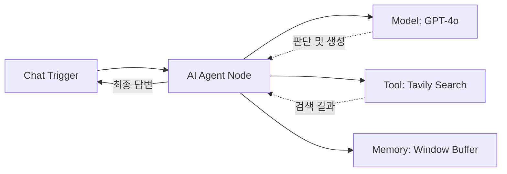

`D:\n8n\docs` 경로에 있는 문서들을 갈무리하여, **n8n의 핵심 가이드**를 하나의 포스트로 정리함.  
셀프 호스팅 설치 방법부터 핵심 노드 사용법, 그리고 최신 트렌드인 **AI 에이전트** 구축까지 다룸.


---

## 1. n8n 셀프 호스팅 설치 (`Installation`)

n8n은 클라우드 버전도 있지만, Docker를 통해 내 컴퓨터(로컬)나 개인 서버에 무료로 설치하여 사용할 수 있음.

### 1-1. Docker로 실행하기
Docker만 설치되어 있다면 명령어 한 줄로 n8n 서버를 띄울 수 있음.

```bash
docker run -d \
  --name n8n-local \
  -p 5678:5678 \
  -v ~/.n8n:/home/node/.n8n \
  --restart unless-stopped \
  n8nio/n8n:latest
```
*   설치 후 접속 주소: `http://localhost:5678`

### 1-2. 외부 연동 (Webhook)
로컬 환경의 n8n이 외부 서비스(Slack, GitHub 등)의 웹훅을 받으려면 외부에서 접속 가능한 주소가 필요함. **Cloudflare Tunnel**을 사용하면 포트 포워딩 없이 안전하게 터널을 뚫을 수 있음.

```bash
# Cloudflared 설치 후 실행
cloudflared tunnel --url http://localhost:5678
```
*   생성된 `https://random-name.trycloudflare.com` 주소를 n8n의 웹훅 URL로 사용하면 됨.

---

## 2. 핵심 노드 가이드 (`Core Nodes`)

n8n의 수많은 노드 중, 데이터 처리에 필수적인 노드들을 정리함.

*   **Edit Fields (Set)**: JSON 데이터의 필드명을 바꾸거나 새로운 값을 추가할 때 사용함. 가장 기본이 되는 노드임.
*   **Code Node**: JavaScript를 사용해 복잡한 데이터 변환 로직을 짤 때 사용함. 없어서는 안 될 만능 노드임.
*   **HTTP Request**: 외부 API와 통신(GET, POST)하여 데이터를 가져오거나 보낼 때 사용함.
*   **Split Out / Aggregate**:
    *   `Split Out`: 리스트(배열) 데이터를 개별 아이템으로 쪼갬 (Loop 시작점).
    *   `Aggregate`: 흩어진 아이템들을 다시 하나의 리스트로 묶음 (취합).

---

## 3. 고급 로직: 병합과 루프 (`Merge & Loop`)

단순한 선형 구조를 넘어 복잡한 로직을 구현하려면 병합과 반복이 필수임.

### 3-1. 데이터 병합 (Merge)
두 개의 데이터 흐름을 하나로 합침. SQL의 JOIN과 비슷함.
*   **Combine by Fields**: 공통된 Key(예: 이메일, ID)를 기준으로 두 데이터를 결합함.
*   **Append**: 단순히 데이터를 뒤에 이어 붙임.

### 3-2. 반복 처리 (Loop Over Items)
대량의 데이터를 처리할 때(Batch), API 속도 제한을 피하거나 안정성을 위해 데이터를 쪼개서 반복 실행함.

---

## 4. 실전 아키텍처: 주간 매출 리포트 자동화

실제 업무에 적용 가능한 자동화 시나리오 구조도임. 매주 월요일, 매출 데이터를 조회해서 상태에 따라 다른 곳으로 보내는 로직임.

```mermaid
graph TD
    A[Schedule Trigger\n(매주 월요일)] --> B[HTTP Request\n(데이터 조회)]
    B --> C{If / Switch\n(상태 분기)}
    
    C -- Status: Processing --> D[Edit Fields\n(데이터 매핑)]
    D --> E[Airtable\n(레코드 생성)]
    
    C -- Status: Booked --> F[Code Node\n(매출 집계)]
    F --> G[Discord\n(봇 알림 전송)]
```

1.  **Trigger**: 매주 월요일 아침 자동 실행.
2.  **Logic**: 주문 상태가 `Processing`이면 Airtable에 기록, `Booked`이면 매출 집계.
3.  **Action**: 최종적으로 Discord 봇이 "이번 주 매출은 $3,500 입니다"라고 보고함.

---

## 5. 최신 트렌드: AI 에이전트 (`AI Agent`)

이제 n8n으로 LangChain 기반의 **AI 에이전트**도 노코드로 만들 수 있음. 스스로 검색하고 판단하는 똑똑한 봇을 만드는 방법임.

### 5-1. 필수 구성 요소
*   **AI Agent Node**: 에이전트의 두뇌. 프롬프트를 통해 역할을 부여함.
*   **Model**: 사용할 LLM (OpenAI GPT-4o, Claude 3.5 Sonnet 등).
*   **Tools**: 에이전트가 사용할 도구 (웹 검색, 계산기, API 호출 등).
*   **Memory**: 대화 맥락을 기억하는 단기 기억 장치.

### 5-2. AI 리서치 에이전트 예시
사용자가 주제를 던져주면, 인터넷을 검색(Search Tool)해서 최신 정보를 요약해 주는 에이전트임.



**시스템 프롬프트 예시**:
> "당신은 리서치 보조원임. 사용자의 질문에 대해 검색 도구를 사용하여 최신 정보를 찾고, 이를 구조화된 보고서 형태로 요약할 것."

---

## 요약

n8n은 단순한 자동화 툴을 넘어, **데이터 파이프라인(ETL)**부터 **AI 에이전트**까지 구축할 수 있는 강력한 플랫폼임. Docker로 가볍게 시작해서 나만의 업무 비서를 만들어 보길 권장함.
