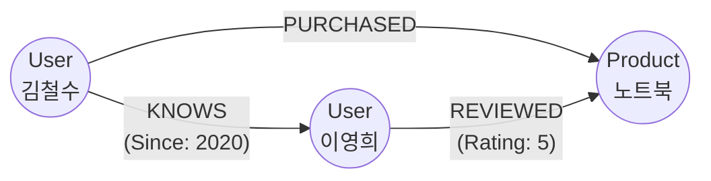

# 🕸️ GraphDB(그래프 데이터베이스)란? 특징 및 RDB와의 비교 정리

최근 데이터 간의 '관계'가 중요해지면서 주목받고 있는 데이터베이스가 있음. 바로 **GraphDB(그래프 데이터베이스)**임. 기존에 널리 쓰이던 RDB(관계형 데이터베이스)와 어떤 점이 다르고, 어떤 특징이 있는지 정리해 봄.

## 1. GraphDB의 핵심 개념

GraphDB는 수학의 '그래프 이론'을 토대로 데이터를 저장하고 표현함. 데이터를 테이블에 담는 것이 아니라 노드(Node)와 엣지(Edge) 형태로 저장하는 것이 가장 큰 특징임.

* **노드(Node/Vertex):** 데이터의 개체(Entity)를 나타냄. (예: 사람, 장소, 사물 등)
* **엣지(Edge/Relationship):** 노드와 노드 사이의 관계(Relationship)를 나타냄. 방향성과 의미(이름)를 가질 수 있음. (예: '친구이다', '구매했다' 등)
* **프로퍼티(Property):** 노드나 엣지가 가지는 속성 정보를 의미함. (예: 사람 노드의 프로퍼티는 '이름', '나이' 등)

*(위 그림처럼 데이터 자체가 직관적인 네트워크 형태(노드와 엣지)로 연결되어 저장됨)*

---

## 2. RDB(관계형 DB) vs GraphDB 

가장 익숙한 RDB와 비교했을 때 어떤 차이가 있는지 구조, 쿼리, 관계 표현 방식을 중심으로 비교해 봄.

### 데이터 구조 (저장 방식의 차이)
* **RDB (엑셀 시트 같은 구조):** 
  데이터를 행과 열로 된 **표(Table)**에 나눠서 예쁘게 정리함. 구조(스키마)가 엄격해서 빈칸이나 예상치 못한 데이터가 들어오는 것을 철저히 관리하기 좋음.
* **GraphDB (마인드맵 같은 구조):** 
  데이터를 점(노드)과 선(엣지)으로 이루어진 거대한 **거미줄(네트워크)** 형태로 저장함. 형태가 자유로워서 새로운 관계나 속성을 추가하기 매우 유연함.

### '관계(Relationship)'를 찾는 방식 (핵심 차이 ⭐)
* **RDB의 방식 (JOIN 연산):** 
  A 파일과 B 파일에서 공통된 번호(외래키)를 찾아 대조하는 방식임. "친구의 친구가 산 물건"을 찾으려면 파일 3~4개를 통째로 뒤져서 맞춰봐야 함 (무거운 JOIN 연산 발생). 데이터가 커질수록 속도가 급격히 느려짐.
* **GraphDB의 방식 (Pointer 순회):** 
  애초에 점과 점이 '선'으로 직접 연결되어 저장됨. "친구의 친구가 산 물건"을 찾을 때, 그냥 선을 따라서 주루룩 넘어가기만 하면 끝남(Index Free Adjacency). 연산 비용이 극도로 적고 엄청나게 빠름.

### 비교 요약 

| 구분 | RDB (관계형 DB) | GraphDB (그래프 DB) |
| :--- | :--- | :--- |
| **저장 단위** | Table, Row, Column | Node, Edge, Property |
| **관계 표현 방식** | Foreign Key (외래키)로 간접 연결 | Edge (관계 선)로 직접 연결 |
| **데이터 탐색 방식** | 무거운 JOIN 연산 (여러 표를 대조) | 가벼운 Pointer 순회 (선을 따라감) |
| **스키마 (구조)** | 엄격함 (사전 정의 必) | 자유롭고 유연함 |
| **가장 잘하는 일** | 데이터 무결성 보장, 단일표 대량 스캔 | 복잡하게 얽힌 깊은 관계망 실시간 탐색 |

---

## 3. GraphDB의 장단점

### 👍 장점
1. **압도적인 탐색 속도:** 꼬리에 꼬리를 무는 복잡한 데이터일수록 RDB(JOIN) 대비 어마어마한 속도 차이를 보여줌. (수백만 개의 관계도 밀리초 단위 통과)
2. **직관적인 모델링:** 현실 세계에서 우리가 화이트보드에 동그라미와 화살표를 그리는 모습 그대로 DB에 저장됨. 이해하기 매우 쉬움.
3. **뛰어난 유연성:** 서비스가 커져서 새로운 종류의 데이터나 연결망이 추가되어도, 기존 구조를 갈아엎을 필요 없이 그냥 노드와 선을 덧붙이면 끝남.

### 👎 단점
1. **단순 대량 스캔에 매우 약함:** "지난달 총 매출액 합계", "30대 유저 전체 목록"처럼 전체를 훑는 단순 작업은 오히려 RDB보다 훨씬 느릴 수 있음. (관계 탐색에만 올인한 구조이기 때문)
2. **학습 곡선 존재:** 친숙한 SQL을 버리고 Cypher(Neo4j) 같은 새로운 그래프 전용 쿼리 언어를 낯설게 배워야 함.
3. **아직은 작은 생태계:** RDB나 MongoDB 같은 주류 NoSQL에 비해 참고할 수 있는 한글 레퍼런스나 커뮤니티 파이가 상대적으로 작음.

---

## 4. 언제 GraphDB를 써야 할까? (진짜 활용 사례)

단순 데이터 기록이 아니라, 데이터 간의 **'연결성(Connect)'**이 비즈니스의 핵심 가치일 때 도입해야 함.

* **🎯 추천 시스템 (Recommendation):** "이 넷플릭스 영화를 본 다른 사람들이 좋아한 또 다른 영화는?" (실시간 연관망 분석)
* **🕵️‍♂️ 부정 거래 탐지 (Fraud Detection):** 수많은 자금 이체 내역에서 '단기간에 여러 계좌를 거쳐 돈을 세탁하는' 검은 돈의 흐름 패턴 포착
* **🌐 소셜 네트워크 (Social Network):** 링크드인의 "1촌, 2촌 추천"이나 페이스북 "알 수도 있는 사람" 계산
* **🗺️ IT 인프라 장애 추적:** 거대한 서버망에서 라우터 1개가 죽었을 때, 그 여파로 죽게 될 모든 서비스 연쇄 추적 (Root Cause Analysis)

---

**💡 3줄 요약:**  
1. GraphDB는 RDB를 대체하는 완벽한 상위 호환이 아니라, **"관계 탐색"에 몰빵한 특수 부대**임.
2. 엑셀처럼 표로 딱딱 떨어지는 데이터 통계는 RDB가 낫고, 마인드맵처럼 복잡하게 얽힌 관계를 추적하는 건 GraphDB가 압도적임.
3. 내 서비스 핵심이 "친구의 친구 찾기", "연관 상품 추천"처럼 꼬리를 무는 형태라면 GraphDB 도입을 1순위로 고민해 봐야 함.
